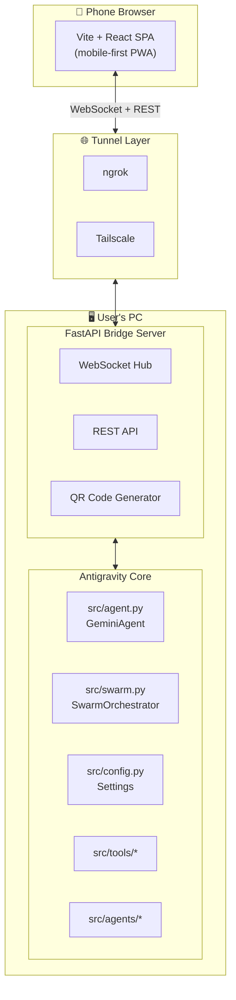

# Antigravity Mobile Connect — Implementation Plan

> **Goal:** Build a mobile-first web client that gives full remote control over the Antigravity agent manager running on the user's PC, accessible via QR code over ngrok or Tailscale.

## Architecture Overview



---

## Technology Choices

| Layer | Technology | Rationale |
|-------|------------|-----------|
| **Mobile UI** | Vite + React + TypeScript | Fast HMR, tree-shaking, modern DX |
| **Styling** | Vanilla CSS with CSS custom properties | Full control, no framework lock-in |
| **Bridge Server** | FastAPI + `uvicorn` | Async-native, WebSocket support, matches existing Python stack |
| **Real-time** | WebSocket (native) | Bi-directional streaming for chat |
| **Tunnel** | ngrok / Tailscale | ngrok for quick public URLs; Tailscale for persistent private mesh |
| **QR Code** | `qrcode[pil]` Python library | Terminal-printed QR for instant phone access |

---

## Proposed Changes

### Phase 0: Foundation & Server Setup [COMPLETED]

> **Deliverable:** A running server that serves a dark-themed mobile shell, accessible via QR code.

---

#### [NEW] [start.py](file:///c:/Users/Joe/Documents/AntigravityMobileConnect/start.py)

Single entry point script that:
1. Checks for ngrok/Tailscale availability
2. Starts the FastAPI bridge server via uvicorn
3. Optionally launches ngrok tunnel
4. Prints a QR code to the terminal with the URL
5. Opens the Vite dev server in parallel (dev mode) or serves the built bundle (prod mode)

---

#### [NEW] server/ directory

```
server/
├── __init__.py
├── app.py              # FastAPI application factory
├── ws_hub.py           # WebSocket connection manager
├── routes/
│   ├── __init__.py
│   ├── chat.py          # Chat message endpoints
│   ├── workspace.py     # Workspace/repo selection
│   ├── agents.py        # Agent discovery & deployment
│   ├── quota.py         # Quota data proxy
│   └── history.py       # Chat history CRUD
└── bridge.py            # Bridge between REST/WS and src/ core
```

- `app.py`: Mounts routes, CORS middleware, static file serving, WebSocket endpoint
- `ws_hub.py`: Manages connected clients, broadcasts agent responses
- `bridge.py`: Imports and wraps `GeminiAgent`, `SwarmOrchestrator`, `Settings` from `src/`

---

#### [NEW] mobile-ui/ directory (Vite + React + TypeScript)

```
mobile-ui/
├── index.html
├── vite.config.ts       # Proxy WS/API to bridge server
├── package.json
├── tsconfig.json
├── src/
│   ├── main.tsx
│   ├── App.tsx           # Router + layout shell
│   ├── index.css         # Design system (dark theme, tokens)
│   ├── hooks/
│   │   ├── useWebSocket.ts
│   │   └── useApi.ts
│   ├── components/
│   │   ├── Shell.tsx      # AppBar, BottomNav, Drawer
│   │   ├── ChatView.tsx
│   │   ├── MessageBubble.tsx
│   │   ├── CommandBar.tsx
│   │   ├── ArtifactViewer.tsx
│   │   ├── WorkspaceSelector.tsx
│   │   ├── ModelSelector.tsx
│   │   ├── AgentCard.tsx
│   │   ├── QuotaDashboard.tsx
│   │   └── HistoryDrawer.tsx
│   └── pages/
│       ├── ChatPage.tsx
│       ├── AgentsPage.tsx
│       ├── QuotaPage.tsx
│       └── SettingsPage.tsx
└── public/
    └── favicon.svg
```

Phase 0 delivers only: `Shell.tsx`, `App.tsx`, `index.css`, routing skeleton, and connection status indicator.

---

#### [MODIFY] [requirements.txt](file:///c:/Users/Joe/Documents/AntigravityMobileConnect/requirements.txt)

Add server dependencies:
```diff
+fastapi>=0.115.0
+uvicorn[standard]>=0.34.0
+websockets>=14.0
+qrcode[pil]>=8.0
+pyngrok>=7.0
```

---

### Phase 1: Chat Interface (Core) [COMPLETED]

> **Deliverable:** Fully functional chat with streaming, command controls, artifact viewing, and review changes.

*(See Phase 1 implementation plan artifact for details)*

#### Known Issues (Persistent)
> [!WARNING]
> The following UI bugs remain unresolved despite initial CSS/JS fixes:
> 1. **Scroll on Refresh**: Chat view does not reliably scroll to the bottom on load/refresh.
> 2. **Zoom Behavior**: Disabling zoom via `viewport` meta tag is not respected on some mobile devices/browsers.
> 3. **Toolbar Positioning**: "Send Message" toolbar floats instead of anchoring firmly to the bottom on some mobile viewports.

---

### Phase 1.5: CDP Mirror (API-Key-Free Chat) [PENDING]

> **Deliverable:** CDP-based chat mirroring from a running Antigravity desktop instance. No API key needed.

#### [NEW] [cdp_client.py](file:///c:/Users/Joe/Documents/AntigravityMobileConnect/server/cdp_client.py)

Chrome DevTools Protocol client:
- `discover_cdp()` — Scan ports 9222, 9000-9003 for Antigravity's CDP endpoint
- `CDPConnection` — WebSocket connection to CDP with `Runtime.evaluate` support
- `capture_snapshot()` — Inject JS to extract chat messages as structured JSON
- `inject_message()` — Type into Antigravity's input and submit
- `get_app_state()` / `stop_generation()` — Remote control helpers

#### [MODIFY] [bridge.py](file:///c:/Users/Joe/Documents/AntigravityMobileConnect/server/bridge.py)

- Add `CDPBridge` class with 1s polling loop and hash-based delta detection
- Route `chat_send` to CDP injection or AgentBridge fallback
- Broadcast `snapshot_update` events when chat content changes

#### [MODIFY] [app.py](file:///c:/Users/Joe/Documents/AntigravityMobileConnect/server/app.py)

- CDP discovery on startup with fallback to AgentBridge
- New WebSocket message types: `snapshot_update`, `cdp_status`
- REST endpoints: `GET /api/cdp/status`, `POST /api/cdp/reconnect`

#### [MODIFY] [ChatPage.tsx](file:///c:/Users/Joe/Documents/AntigravityMobileConnect/mobile-ui/src/pages/ChatPage.tsx) + [App.tsx](file:///c:/Users/Joe/Documents/AntigravityMobileConnect/mobile-ui/src/App.tsx)

- Handle `snapshot_update` messages to render chat from desktop
- Show CDP connection status in nav bar

---

### Phase 2: Workspace & Model Selection [PENDING]

> **Deliverable:** Switch workspaces and models from mobile.

#### [NEW] [WorkspaceSelector.tsx](file:///c:/Users/Joe/Documents/AntigravityMobileConnect/mobile-ui/src/components/WorkspaceSelector.tsx)

- List available workspaces/repos on the PC
- One-tap to switch active workspace
- Shows current workspace prominently in the AppBar

#### [NEW] [ModelSelector.tsx](file:///c:/Users/Joe/Documents/AntigravityMobileConnect/mobile-ui/src/components/ModelSelector.tsx)

- Dropdown of available Gemini + OpenAI models
- Updates `Settings.GEMINI_MODEL_NAME` via API call

#### [NEW] [TabMenu.tsx](file:///c:/Users/Joe/Documents/AntigravityMobileConnect/mobile-ui/src/components/TabMenu.tsx)

Three-tab strip above chat: **Changes Overview** | **Terminal** | **Artifacts**
- Changes Overview: file diff summary
- Terminal: read-only terminal output stream
- Artifacts: browse `artifacts/` directory

#### [MODIFY] [server/routes/workspace.py](file:///c:/Users/Joe/Documents/AntigravityMobileConnect/server/routes/workspace.py)

- `GET /api/workspaces` — List available workspaces
- `POST /api/workspace/select` — Switch active workspace
- `GET /api/models` — List available models
- `POST /api/model/select` — Switch model

---

### Phase 3: Chat History [PENDING]

> **Deliverable:** Persistent chat history, accessible from a drawer.

#### [NEW] [HistoryDrawer.tsx](file:///c:/Users/Joe/Documents/AntigravityMobileConnect/mobile-ui/src/components/HistoryDrawer.tsx)

- Slide-in drawer with chat list (title, date, preview)
- Search bar with fuzzy filtering
- Tap to reopen, long-press to delete

#### [MODIFY] [server/routes/history.py](file:///c:/Users/Joe/Documents/AntigravityMobileConnect/server/routes/history.py)

- `GET /api/history` — List saved conversations
- `GET /api/history/{id}` — Load a specific conversation
- `DELETE /api/history/{id}` — Delete a conversation
- Conversations auto-saved to `artifacts/chat_history/` as JSON

---

### Phase 4: Agent Discovery & Deployment [PENDING]

> **Deliverable:** Browse agents, deploy individuals or swarms with one tap.

#### [NEW] [AgentCard.tsx](file:///c:/Users/Joe/Documents/AntigravityMobileConnect/mobile-ui/src/components/AgentCard.tsx)

- Card UI for each agent: name, role, description, status badge
- "Deploy" button per agent
- "Deploy Swarm" FAB that launches `SwarmOrchestrator.execute()`

#### [MODIFY] [server/routes/agents.py](file:///c:/Users/Joe/Documents/AntigravityMobileConnect/server/routes/agents.py)

- `GET /api/agents` — Scan `src/agents/` and return metadata
- `POST /api/agents/{name}/deploy` — Deploy a single agent
- `POST /api/swarm/deploy` — Launch full swarm with a task
- `GET /api/agents/{name}/status` — Check running agent status

---

### Phase 5: Quota Dashboard [PENDING]

> **Deliverable:** Cockpit-style quota monitoring modeled off the Antigravity VS Code extension.

#### [NEW] [QuotaDashboard.tsx](file:///c:/Users/Joe/Documents/AntigravityMobileConnect/mobile-ui/src/components/QuotaDashboard.tsx)

Modeled after the Antigravity Cockpit extension:

| Feature | Implementation |
|---------|---------------|
| **Card/List toggle** | ViewMode switch with CSS grid vs. list layout |
| **Quota pools** | Group models by shared pool, collapsible sections |
| **Burn-rate analysis** | Rolling average tokens/min with trend arrow |
| **Exhaustion prediction** | ETA bar: "~X hours remaining at current rate" |
| **Warning thresholds** | Yellow (≤25%), Red (≤10%) with animated ring indicators |
| **Refresh** | Pull-to-refresh + auto-refresh interval |
| **Status bar** | Floating mini-badge showing most critical quota |

#### [MODIFY] [server/routes/quota.py](file:///c:/Users/Joe/Documents/AntigravityMobileConnect/server/routes/quota.py)

- `GET /api/quota` — Fetch quota data from Antigravity API
- `GET /api/quota/pools` — Grouped quota pools
- `GET /api/quota/settings` — Warning/danger threshold config
- `POST /api/quota/settings` — Update thresholds

---

### Phase 6: Polish & Documentation [PENDING]

- Final mobile responsiveness sweep (iOS Safari, Android Chrome)
- PWA manifest + service worker for installability  
- Update `README.md` with mobile-connect section
- Create walkthrough artifact with screenshots and recordings

---

## User Review Required

> [!IMPORTANT]
> **Tunnel strategy**: The plan supports both ngrok (quick public URL) and Tailscale (persistent private mesh). Phase 0 will auto-detect which is available and fall back accordingly. Is this acceptable, or do you want one to be the primary/only option?

> [!IMPORTANT]
> **Antigravity agent control**: The bridge server wraps `GeminiAgent` and `SwarmOrchestrator` from `src/`. Some features like "Review Changes" and "Terminal" assume we can intercept the agent's file-change and command-execution events. This may require modifications to the core `agent.py` to emit events. Is modifying `src/agent.py` acceptable?

> [!WARNING]
> **Quota API access**: The Cockpit-style quota dashboard requires access to the Google Antigravity quota API. If you have API credentials or know the endpoint, please share. Otherwise, Phase 5 will use mock data initially and be wired up later.

---

## Decision Log

| # | Decision | Alternatives Considered | Rationale |
|---|----------|------------------------|-----------|
| 1 | **Vite + React** for mobile UI | PWA with vanilla JS; React Native; Flutter | React gives component reuse, fast HMR, and the team's existing JS familiarity. Vite is the fastest bundler. Native frameworks add build complexity without benefit for a simple control panel. |
| 2 | **FastAPI bridge** in Python | Express.js; Go server; direct browser-to-agent | Python aligns with the existing `src/` stack. FastAPI offers native async + WebSocket support. No cross-language serialization needed. |
| 3 | **WebSocket** for real-time | SSE; polling; gRPC-web | WebSocket is bi-directional (needed for both streaming responses AND sending commands), well-supported on mobile browsers, and simple to implement with FastAPI. |
| 4 | **Vanilla CSS** (no Tailwind) | Tailwind; CSS-in-JS; Material UI | User guidelines specify vanilla CSS. Custom properties give theming without framework overhead. |
| 5 | **Single `start.py`** launcher | Docker Compose; npm scripts; Makefile | One script is the simplest DX. Docker Compose is available for containerized deployment but not required. |
| 6 | **Chat history as JSON files** | SQLite; Redis; in-memory | JSON files in `artifacts/chat_history/` align with the artifact-first philosophy. No extra dependencies. Scale is single-user so files are sufficient. |
| 7 | **Phased rollout** (7 phases) | Big-bang delivery | Each phase delivers a working product. Phase 0 gives a usable shell; Phase 1 gives a working chat. User can test and iterate at every phase boundary. |

---

## Verification Plan

### Phase 0 Verification (Automated)

```bash
# 1. Install server dependencies
cd c:\Users\Joe\Documents\AntigravityMobileConnect
pip install -r requirements.txt

# 2. Install mobile-ui dependencies  
cd mobile-ui && npm install && cd ..

# 3. Run the start script
python start.py --dev

# Expected: QR code printed in terminal, server accessible at localhost:8000
# Expected: Mobile UI accessible at localhost:5173 (Vite dev server)
```

### Phase 0 Verification (Browser)

1. Open QR code URL on phone (or `localhost:5173` on desktop)
2. Verify dark-themed shell loads with navigation bar
3. Verify "Connected" status indicator is green
4. Verify bottom navigation tabs are visible and tappable

### Phase 1 Verification (Browser)

1. Open chat page on mobile browser
2. Type a message and tap send → verify message appears in chat
3. Verify agent response streams in real-time
4. Tap "Expand all" → verify all collapsible sections expand
5. Verify "Run" button triggers command execution
6. Verify "Reject" button cancels pending command
7. Open Review Changes → verify diff display, approve/reject buttons work

### Phase 4 Verification (Browser)

1. Navigate to Agents page
2. Verify 4 agents shown (Router, Coder, Reviewer, Researcher)
3. Tap "Deploy" on an agent → verify status changes
4. Tap "Deploy Swarm" → verify SwarmOrchestrator starts

### Phase 5 Verification (Browser)

1. Navigate to Quota page
2. Verify card view shows quota gauges
3. Toggle to list view → verify layout changes
4. Pull to refresh → verify data updates
5. Verify warning colors at configured thresholds

### Existing Tests

The project has existing tests in `tests/`:
- `test_agent.py` — validates agent initialization and tool loading
- `test_swarm.py` — validates orchestrator and message bus
- `test_memory.py` — validates memory serialization

These will be run after `server/bridge.py` wraps the core modules to ensure no regressions:

```bash
cd c:\Users\Joe\Documents\AntigravityMobileConnect
python -m pytest tests/ -v
```

### New Tests to Add

```bash
# server/tests/test_routes.py — FastAPI TestClient tests for all REST endpoints
# server/tests/test_ws.py — WebSocket connection and message relay tests
cd c:\Users\Joe\Documents\AntigravityMobileConnect
python -m pytest server/tests/ -v
```
