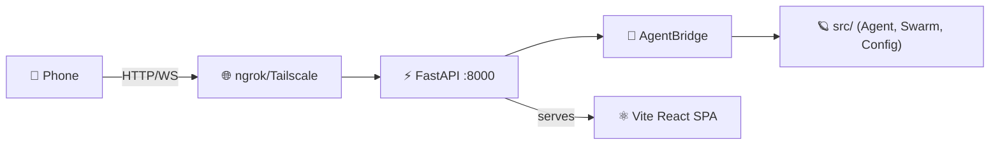

# Antigravity Mobile Connect — Phase 0 Walkthrough

## What Was Built

Phase 0 delivers a **fully functional foundation**: FastAPI bridge server serving a dark-themed React mobile UI with chat history auto-save, accessible via QR code over ngrok or Tailscale.

## Architecture



## Files Created

### Server (`server/`)
| File | Purpose |
|------|---------|
| [app.py](file:///c:/Users/Joe/Documents/AntigravityMobileConnect/server/app.py) | FastAPI factory — routes, CORS, WebSocket, static serving |
| [ws_hub.py](file:///c:/Users/Joe/Documents/AntigravityMobileConnect/server/ws_hub.py) | WebSocket connection manager |
| [bridge.py](file:///c:/Users/Joe/Documents/AntigravityMobileConnect/server/bridge.py) | Bridge wrapping `GeminiAgent`, `SwarmOrchestrator`, `Settings` |
| [routes/chat.py](file:///c:/Users/Joe/Documents/AntigravityMobileConnect/server/routes/chat.py) | Chat send, history, action endpoints |
| [routes/workspace.py](file:///c:/Users/Joe/Documents/AntigravityMobileConnect/server/routes/workspace.py) | Workspace/model selection |
| [routes/agents.py](file:///c:/Users/Joe/Documents/AntigravityMobileConnect/server/routes/agents.py) | Agent discovery and deployment |
| [routes/quota.py](file:///c:/Users/Joe/Documents/AntigravityMobileConnect/server/routes/quota.py) | Cockpit-style quota data (mock) |
| [routes/history.py](file:///c:/Users/Joe/Documents/AntigravityMobileConnect/server/routes/history.py) | Chat history CRUD with auto-save on new chat |

### Mobile UI (`mobile-ui/`)
| File | Purpose |
|------|---------|
| [App.tsx](file:///c:/Users/Joe/Documents/AntigravityMobileConnect/mobile-ui/src/App.tsx) | Shell: top nav, 5-tab bottom nav, page routing |
| [index.css](file:///c:/Users/Joe/Documents/AntigravityMobileConnect/mobile-ui/src/index.css) | Dark design system (deep space palette, glassmorphism) |
| [ChatPage.tsx](file:///c:/Users/Joe/Documents/AntigravityMobileConnect/mobile-ui/src/pages/ChatPage.tsx) | Chat with auto-save, action bar, "✨ New Chat" button |
| [HistoryPage.tsx](file:///c:/Users/Joe/Documents/AntigravityMobileConnect/mobile-ui/src/pages/HistoryPage.tsx) | Browse, search, open, delete old conversations |
| [AgentsPage.tsx](file:///c:/Users/Joe/Documents/AntigravityMobileConnect/mobile-ui/src/pages/AgentsPage.tsx) | Agent grid + swarm deploy |
| [QuotaPage.tsx](file:///c:/Users/Joe/Documents/AntigravityMobileConnect/mobile-ui/src/pages/QuotaPage.tsx) | Cockpit-style dashboard with ring gauges |
| [SettingsPage.tsx](file:///c:/Users/Joe/Documents/AntigravityMobileConnect/mobile-ui/src/pages/SettingsPage.tsx) | Workspace/model selection |
| [useWebSocket.ts](file:///c:/Users/Joe/Documents/AntigravityMobileConnect/mobile-ui/src/hooks/useWebSocket.ts) | Auto-reconnect WebSocket hook |
| [useApi.ts](file:///c:/Users/Joe/Documents/AntigravityMobileConnect/mobile-ui/src/hooks/useApi.ts) | REST API hook |

### Documentation
| File | Purpose |
|------|---------|
| [README.md](file:///c:/Users/Joe/Documents/AntigravityMobileConnect/docs/en/mobile-connect/README.md) | Quick start, features, API reference, roadmap |
| [architecture.md](file:///c:/Users/Joe/Documents/AntigravityMobileConnect/docs/en/mobile-connect/architecture.md) | System design, Mermaid diagrams, data flows |

### Launcher
| File | Purpose |
|------|---------|
| [start.py](file:///c:/Users/Joe/Documents/AntigravityMobileConnect/start.py) | Single-script launcher with QR code, ngrok/Tailscale auto-detection |

## Verification Results

| Endpoint | Status | Response |
|----------|--------|----------|
| `GET /api/health` | ✅ 200 | `{"status":"ok","clients":0,"version":"0.1.0"}` |
| `GET /api/agents/` | ✅ 200 | 5 agents: Base, Coder, Researcher, Reviewer, Router |
| `GET /api/quota/` | ✅ 200 | 3 model quotas (Premium + Standard pools) |
| `POST /api/chat/send` | ✅ 200 | Agent echo response (Phase 0 mode) |
| `GET /` | ✅ 200 | Static React SPA served from `dist/` |
| Vite build | ✅ | 36 modules, 211KB JS, 9.8KB CSS |

## How to Run

```bash
python start.py          # Production (serves built UI)
python start.py --dev    # Dev mode (Vite HMR)
python start.py --ngrok  # With ngrok tunnel
```

