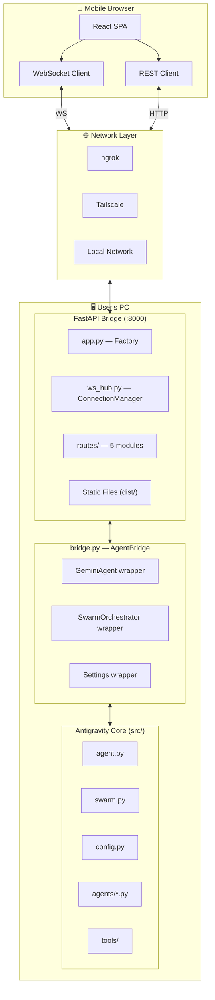
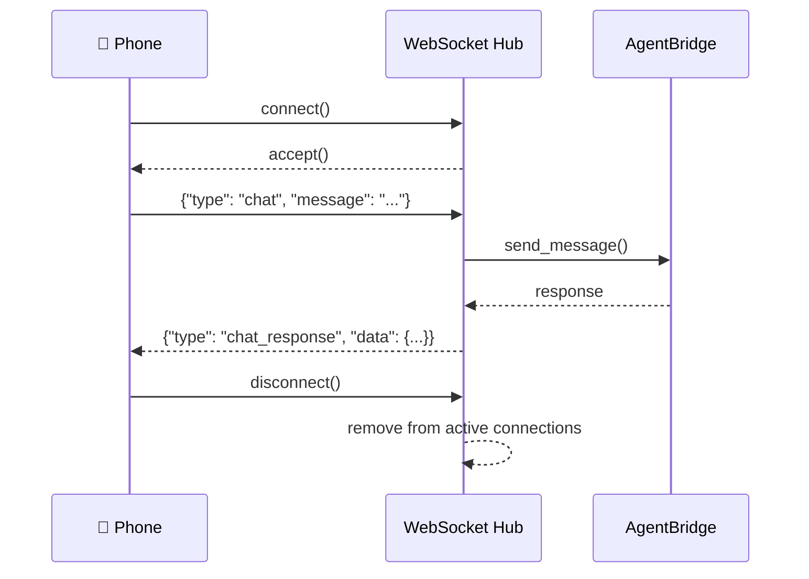
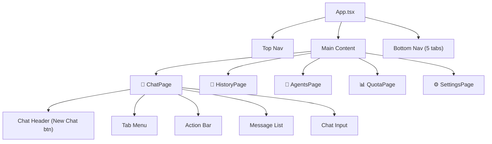
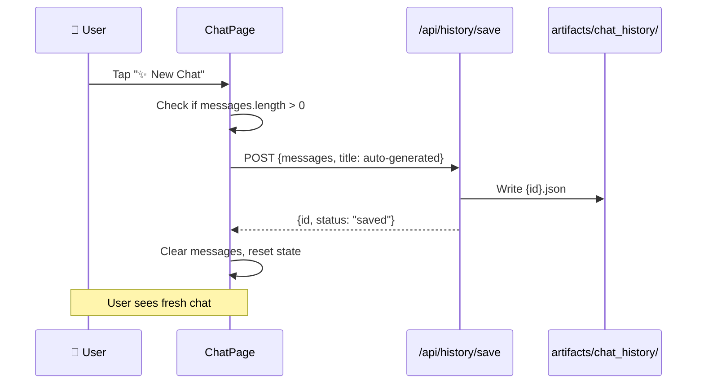
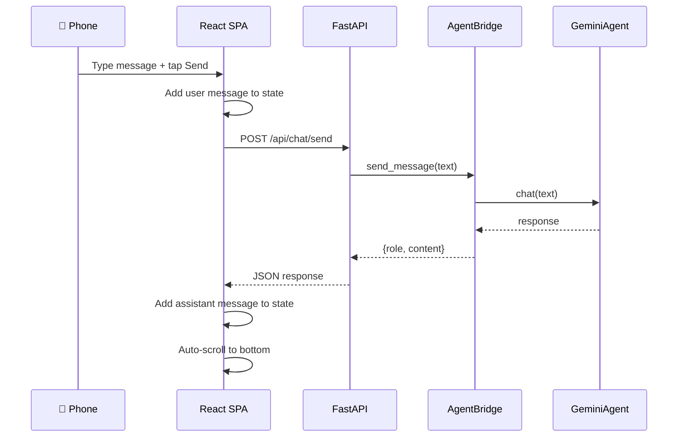

# Antigravity Mobile Connect — Architecture & Design

## 1. System Architecture

### 1.1 Overview

Antigravity Mobile Connect follows a **bridge server** pattern. A FastAPI server runs on the same machine as the Antigravity core, exposing the agent's capabilities via REST and WebSocket APIs. A React SPA, optimized for mobile browsers, connects to this server.



### 1.2 Design Decisions

| Decision | Choice | Rationale |
|----------|--------|-----------|
| **UI framework** | Vite + React + TypeScript | Fast HMR, component model, type safety |
| **Server** | FastAPI + uvicorn | Async-native, WebSocket support, matches Python stack |
| **Real-time** | WebSocket | Bi-directional needed for streaming + commands |
| **Styling** | Vanilla CSS + custom properties | Full control, no framework overhead |
| **Connectivity** | ngrok + Tailscale auto-detect | Quick public URLs (ngrok) OR persistent mesh (Tailscale) |
| **Chat storage** | JSON files in `artifacts/chat_history/` | Artifact-first philosophy, no extra deps |
| **Launcher** | Single `start.py` | Minimal DX friction |

---

## 2. Server Layer

### 2.1 Application Factory (`app.py`)

The `create_app()` factory:
1. Creates a FastAPI instance with metadata
2. Configures CORS (allows all origins for mobile access)
3. Mounts all 5 route modules
4. Defines the WebSocket endpoint at `/ws`
5. Mounts static files from `mobile-ui/dist/` for production serving
6. Provides a health check at `/api/health`

### 2.2 WebSocket Hub (`ws_hub.py`)

`ConnectionManager` manages the WebSocket lifecycle:



Key behaviors:
- **Auto-cleanup** on disconnect
- **Broadcast** capability for multi-client scenarios
- **Personal messages** for targeted responses
- **JSON serialization** for all messages

### 2.3 Bridge Layer (`bridge.py`)

`AgentBridge` is the translation layer between the HTTP/WS API and the Antigravity core:

| Method | Core Integration | Phase 0 Behavior |
|--------|-----------------|-------------------|
| `send_message()` | `GeminiAgent.chat()` | Returns echo response |
| `list_workspaces()` | Scans filesystem | Returns found `.py` projects |
| `list_models()` | `Settings.GEMINI_MODEL_NAME` | Returns hardcoded model list |
| `list_agents()` | Scans `src/agents/` | Returns agent file metadata |
| `deploy_agent()` | `GeminiAgent.run()` | Returns status stub |
| `deploy_swarm()` | `SwarmOrchestrator.execute()` | Returns status stub |

### 2.4 Route Modules

Five focused route modules in `server/routes/`:

| Module | Prefix | Endpoints | Purpose |
|--------|--------|-----------|---------|
| `chat.py` | `/api/chat` | 3 | Message send, history, actions |
| `workspace.py` | `/api` | 4 | Workspace & model CRUD |
| `agents.py` | `/api/agents` | 3 | Discovery, deploy, swarm |
| `quota.py` | `/api/quota` | 2 | Usage data & thresholds |
| `history.py` | `/api/history` | 4 | Conversation CRUD with auto-save |

---

## 3. Mobile UI Layer

### 3.1 Design System (`index.css`)

The CSS design system uses custom properties for a **deep space dark theme**:

| Token Category | Examples |
|----------------|----------|
| **Colors** | `--bg-primary: #0a0e17`, `--accent-primary: #6c5ce7` |
| **Glassmorphism** | `backdrop-filter: blur(20px) saturate(1.8)` |
| **Typography** | Inter (UI), JetBrains Mono (code) |
| **Spacing** | 4px grid: `--space-xs` through `--space-2xl` |
| **Animations** | `fadeIn`, `slideIn`, `pulse` with cubic-bezier easing |
| **Components** | Cards, buttons, selectors, message bubbles, quota rings |

### 3.2 Component Tree



### 3.3 Hooks

| Hook | Purpose | Key Features |
|------|---------|--------------|
| `useWebSocket` | WebSocket connection | Auto-reconnect with exponential backoff (1s → 30s max) |
| `useApi` | REST API calls | Loading state, error handling, typed responses |

### 3.4 Chat Auto-Save Flow



---

## 4. Connectivity Layer

### 4.1 Network Detection Order

`start.py` checks for connectivity in this order:

1. **Tailscale** — Checks for `tailscale` binary and active IP
2. **ngrok** — Starts tunnel if `--ngrok` flag or `pyngrok` available
3. **LAN** — Falls back to local network IP

### 4.2 QR Code

The launcher generates an ASCII QR code printed directly to the terminal, encoding the access URL. This allows instant phone access by scanning.

---

## 5. Data Flow

### 5.1 Chat Message Flow



### 5.2 History Persistence

Conversations are stored as JSON files:

```
artifacts/chat_history/
├── a1b2c3d4-...-uuid.json
├── e5f6g7h8-...-uuid.json
└── ...
```

Each file structure:
```json
{
  "id": "uuid",
  "title": "auto-generated from first user message",
  "created_at": "ISO 8601",
  "messages": [
    {"role": "user", "content": "..."},
    {"role": "assistant", "content": "..."}
  ]
}
```

---

## 6. Security Considerations

> [!WARNING]
> Phase 0 has minimal security. Production hardening is planned for later phases.

| Concern | Current State | Future Plan |
|---------|---------------|-------------|
| **CORS** | Allow all origins | Restrict to known tunnel URLs |
| **Authentication** | None | Token-based auth on server |
| **Input validation** | Basic FastAPI types | Pydantic models for all inputs |
| **Transport** | HTTP (ngrok provides HTTPS) | Enforce HTTPS everywhere |

---

## 7. Performance Characteristics

| Metric | Value |
|--------|-------|
| **JS bundle** | 211 KB (65.9 KB gzip) |
| **CSS** | 9.8 KB (2.8 KB gzip) |
| **Server startup** | < 1 second |
| **First paint** | < 500ms on LAN |
| **WebSocket reconnect** | 1s initial, 30s max backoff |
